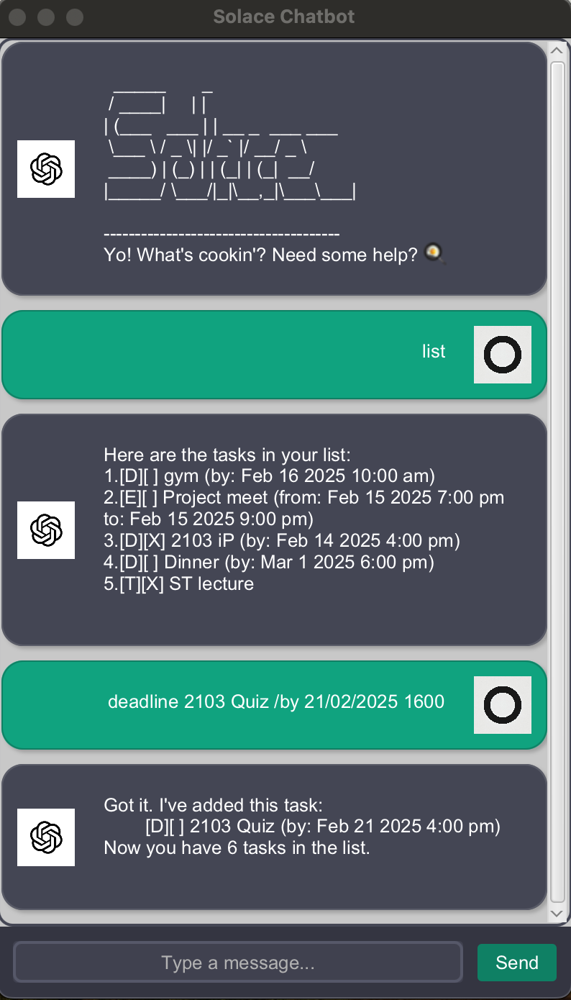

# Solace User Guide 💬
**Version:** 2.0  
**Last Updated:** February 2025

---

## **Table of Contents**
1. [Introduction](#introduction)
2. [Quick Start](#quick-start)
3. [Features](#features)
    - [Adding a To-Do Task](#adding-a-to-do-task)
    - [Adding a Deadline Task](#adding-a-deadline-task)
    - [Adding an Event Task](#adding-an-event-task)
    - [Listing All Tasks](#listing-all-tasks)
    - [Marking a Task as Done](#marking-a-task-as-done)
    - [Unmarking a Task](#unmarking-a-task)
    - [Deleting a Task](#deleting-a-task)
    - [Finding Tasks](#finding-tasks)
    - [Saving Tasks](#saving-tasks)
    - [Exiting the Application](#exiting-the-application)
4. [Command Summary](#command-summary)
5. [FAQ](#faq)
6. [UI Overview](#ui-overview)

---

## **Introduction**

**Solace** is a playful and interactive chatbot application inspired by the ChatGPT theme. It helps you declutter your mind and stay on top of your tasks effortlessly, allowing you to focus on what truly matters. Solace is designed with simplicity and intuition in mind, featuring a text-based interface for a distraction-free experience.

---

## **Quick Start**

1. Ensure you have **Java 11 or later** installed on your computer.

2. Download the latest `Solace.jar` from the [releases page](https://github.com/your-username/solace-chatbot/releases).

3. Open a terminal or command prompt and navigate to the folder where you downloaded the JAR file.

4. Run the application using the following command:
    ```sh
    java -jar Solace.jar
    ```

5. You should see the welcome message:
    ```
      _____       _     
     / ____|     | |    
    | (___   ___ | | __ _  ___ ___  
     \___ \ / _ \| |/ _` |/ __/ _ \ 
     ____) | (_) | | (_| | (_|  __/ 
    |_____/ \___/|_|\__,_|\___\___| 

    --------------------------------------
    Hello! I'm Solace
    What can I do for you?
    ```

---

## **Features**

### **Adding a To-Do Task**
Adds a simple to-do task to your task list.

**Format:** 
`todo <description>`
- The description should not be empty.

**Example:** `todo Read a book`
___

### **Adding a Deadline Task**
Adds a task with a deadline to your task list.

**Format:** 
`deadline <description> /by <deadline>`
- The description should not be empty.
- The deadline should be in the format `dd/MM/yyyy HHMM`.
- The deadline can also take in a string but will not parse correctly

**Example:** `deadline Submit report /by 20/09/2025 2359`, 
`deadline Submit report /by tomorrow`

___

### **Adding an Event Task**
Adds an event task to your task list.

**Format:** 
`event <description> /from <time> /to <time>`
- The description should not be empty.
- The time should be in the format `dd/MM/yyyy HHMM`.
- The time can also take in a string but will not parse correctly

**Example**: `event Project meeting /from 20/09/2025 1400 /to 20/09/2025 1600`,
`event Project meeting /from today 1400 /to 1600`

___

### **Listing All Tasks**
Displays all the tasks currently in your task list. Sorted Chronologically from today's date.

**Format:**
`list`

___


### **Marking a Task as Done**
Marks the specified task as completed.

**Format:** 
`mark <task number>`, `mark 1 2 3`
- The task number corresponds to the number shown in the task list.
- You can mark multiple tasks at once by separating the task numbers with spaces.

___

### **Unmarking a Task**
Marks the specified task as not completed.

**Format:** 
`unmark <task number>`
- The task number corresponds to the number shown in the task list.

___

### **Deleting a Task**
Deletes the specified task from your task list.

**Format:** 
`delete <task number>`
- The task number corresponds to the number shown in the task list.

___

### **Finding Tasks**
Finds tasks that contain the specified keyword.

**Format:**
`find <keyword>`
- The keyword is case-sensitive.
- Only tasks with descriptions containing the keyword will be displayed.
- The keyword should not be empty.

**Example:** `find book`

___

### **Saving Tasks**
Saves the current tasks to a storage file.

**Format:** 
`save`
- Storage will be created on launch if it does not exist.
___

### **Exiting the Application**
Exits the Solace application.

**Format:** 
`bye`

___

## **Command Summary**

| Command                        | Description                                           |
| -------------------------------| ------------------------------------------------------|
| `todo <description>`           | Adds a simple to-do task.                             |
| `deadline <description> /by <due date>` | Adds a task with a deadline.                |
| `event <description> /from <start time> /to <end time>` | Adds an event task.          |
| `list`                         | Displays all tasks in the task list.                  |
| `mark <task number>`            | Marks the specified task as done.                     |
| `unmark <task number>`          | Marks the specified task as not done.                 |
| `delete <task number>`          | Deletes the specified task.                          |
| `find <keyword>`                | Finds tasks that contain the keyword.                 |
| `save`                         | Saves the current tasks to a storage file.            |
| `bye`                          | Exits the Solace application.                        |

---

## **FAQ**

### Q: Where are my tasks saved?
- A: Your tasks are saved in a file located in the `bin/storage` directory.

### Q: Can I add multiple deadlines or events at once?
- A: Currently, Solace supports adding one task at a time. You can repeat the command to add more tasks.

### Q: What happens if I close Solace without saving?
- A: Your tasks will not be saved. Remember to use the `save` command before exiting.

### Q: Can I edit a task once it's added?
- A: No, currently, you can only delete and re-add the task with the updated details.

---

## **UI Overview**

This is what the user interface looks like:


- **User Messages** are displayed on the right with a green background.
- **Bot Responses** are displayed on the left with a darker background.
- **Scroll Pane** allows you to review previous messages effortlessly.

___

## **Feedback and Support**

If you encounter any issues or have suggestions for new features, feel free to:
- Open an issue on the [GitHub repository](https://github.com/nictjh/ip/issues)
- Contact us via email at **nicholastok0101@gmail.com**.

---

## **Enjoy using Solace!** 🎉
